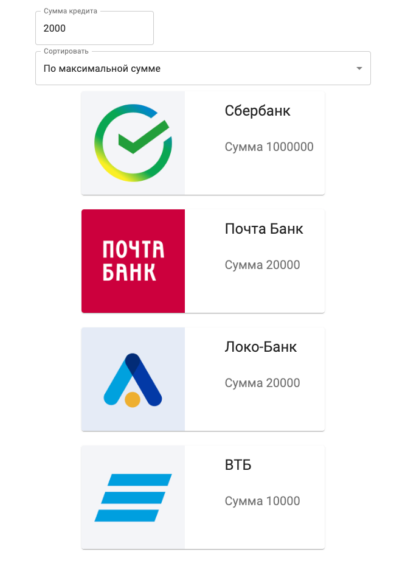

# Тестовое задание Banki.ru (frontend)
# Функционал
- есть возможность отсортировать кредитные продукты по сумме: от большего к меньшему и наоборот.
- реализован фильтр продуктов по сумме, сумма указанная в фильтре это минимальная сумма, которую клиент хочет получить в кредит
- есть возможность сохранять результаты поиска на клиентской стороне и передавать эти результаты другим пользователям сервиса

### Технологии: 
React, redux, typescript, material ui

### Деплой проекта: 



#### Запуск проекта

#### Скачайте архив проекта или склонируйте репозиторий

```sh
git@github.com:lkhusnullina/test_bankiru.git
```

#### Установите зависимости проекта

```sh
npm install
```
#### Запустите проект командой

```sh
npm run start
```